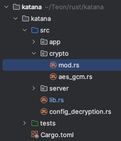

# Basic

## 建立專案

* 用 command line 建立 Rust 專案

```bash
# 建立 hello_rust 專案（包含 main）
cargo new hello_rust 

# 建立 hello_rust 函式庫
cargo new hello_rust --lib 

# 建立 hello_rust 函式庫，不設定版本控制
cargo new hello_rust --lib --vcs=none
```

* 先建立資料夾再建立 Rust 專案

```bash
# 建立 hello_rust 資料夾
mkdir hello_rust

# 進入 hello_rust 專案
cd hello_rust

# 建立 Rust 專案
cargo init --lib --vcs=none
```

## 建立 submodule

### 根據範例，我想建立一個 crypto 的 submodule，應該怎麼做？



1. 首先，建立資料夾 `crypto`
2. 然後進入 `crypto` 資料夾，建立 `mod.rs`
3. 之後再根據需求增加其他的 module，例如 `aes_gcm.rs`