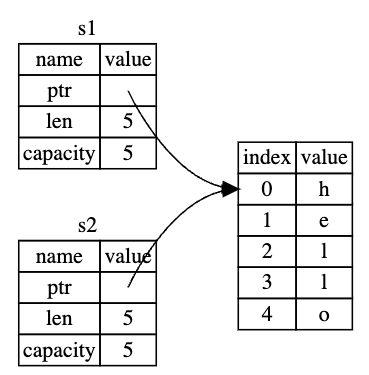
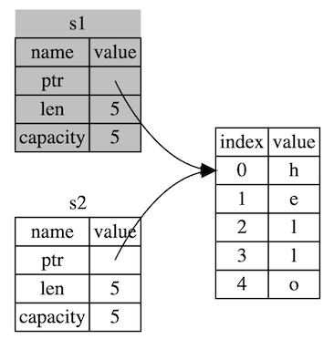
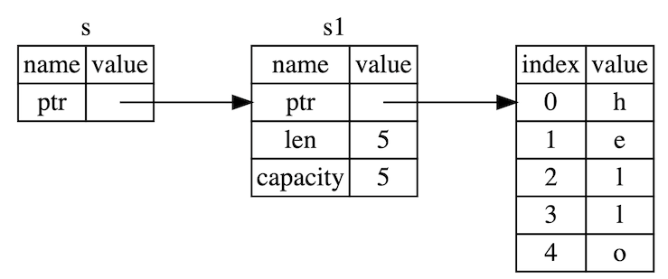
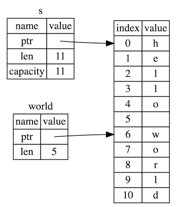

# 擁有權 Ownership

現今的高階程式語言 (Kotlin, Java...) 大都會使用 GC (Garbage Collection) 機制來回收記憶體，有些程式語言則是開發者需自行手動配置和釋放記憶體，然而在 Rust 中是使用 Ownership 機制來做記憶體管理．

## 什麼是擁有權？

### GC 的回收機制

舉個例子，在 Kotlin 中宣告一個字串後再指定給另一個變數，然後印出兩個變數，稀鬆平常～

```kotlin
val s1 = "hello"
val s2 = s1
println("s1: $s1, s2: $s2")

// 結果為
// s1: hello, s2: hello
```

兩個 Stack 記憶體 (s1, s3) 參考 (refer) 到同一個 Heap 物件 (字串 "hello")，GC 會持續觀察是否還有 Stack 記憶體參考到該物件，如果沒有，GC 就會清空該 Heap 物件進而達到記憶體回收．



### 擁有權

同樣的邏輯在 Rust 中卻無法編譯 😕

```rust
// 此程式碼無法編譯
let s1 = String::from("hello");
let s2 = s1;
println!("s1: {}, s2: {}", s1, s2); // 會發生 "value borrowed here after move" 錯誤
```

這是因為 Rust 並沒有使用 GC 而是使用擁有權機制來管理記憶體，以下是擁有權規則：

* Rust 中每個數值都有一個擁有者（owner）。
* 同時間只能有一個擁有者。
* 當擁有者離開作用域時，數值就會被丟棄。

### 變數作用域

我們先來看變數的作用域（scope）。作用域是一個項目在程式內的有效範圍（A scope is the range within a program for which an item is valid. ）。


```rust
{                                   // s 在此處無效，因為它還沒宣告
    let s = String::from("hello");  // s 在此開始視為有效
    // 使用 s
}                                   // 此作用域結束， s 不再有效
```

* 當 `s` 進入作用域時，它是有效的。
* 它持續被視為有效直到它離開作用域為止。

當 `s` 離開作用域時，我們就可以將 String 所需要的記憶體釋放。當變數離開作用域時，Rust 會幫我們呼叫一個特殊函式。此函式叫做 `drop`，在這裡當時 String 的作者就可以寫入釋放記憶體的程式碼。Rust 會在大括號結束時自動呼叫 `drop`。

回到上面字串分配給兩個變數的範例，當兩個變數都離開作用域時會發生呼叫 `drop` 兩次，這時就會發生重複釋放記憶體的錯誤 (double free error)。

### 移動 (Move)

```rust
let s1 = String::from("hello");     // s1 是字串 "hello" 的擁有者
let s2 = s1;                        // s1 將擁有權轉給 s2，現在 s2 是字串 "hello" 的擁有者
                                    // s1 移動擁有權給 s2 的動作稱為 "move" 
```

為了保障記憶體安全，在 `let s2 = s1;` 之後，Rust 就不再將 `s1` 視爲有效。



所有權不只會發生在變數轉移，函數傳遞參數、回傳值也會發生。

```rust
fn main() {
    let s1 = String::from("hello");

    // "hello" 的擁有權由 s1 傳入 takes_and_gives_back 裡再傳出來給 s2
    let s2 = takes_and_gives_back(s1);
    
    println!("s2: {}", s2);
    
    // 想同時回多個值（傳擁有權及其他值）可以使用 tuple
    let (s3, length) = get_length(s2);
    println!("s3: {}, length: {}", s3, length);
}

// 此函式會取得一個 String 然後回傳它
fn takes_and_gives_back(a_string: String) -> String {
    // a_string 進入作用域
    println!("a_string: {}", a_string);

    a_string // 回傳 a_string 並移動給呼叫的函式
}

// 此函式會回傳字串及字串的長度
fn get_length(s: String) -> (String, usize) {
    let length = s.len();
    (s, length)
}
```

這樣取得擁有權再回傳擁有權的確有點囉唆。有沒有更簡單的做法？ Rust 有提供一個概念能在不轉移所有權的狀況下使用數值，這叫做參考（references）。

## 參考與借用

參考（references） 就像是指向某個地址的指標，我們可以追蹤存取到該處儲存的資訊，而該地址仍被其他變數所擁有。和指標不一樣的是，參考保證所指向的特定型別的數值一定是有效的。

```rust
pub fn main() {
    let s1 = String::from("hello");
    let len = calculate_length(&s1); //「&」符號就是參考，它允許你不必獲取所有權來參考它
    println!("The length of '{}' is {}.", s1, len);
}

fn calculate_length(s: &String) -> usize { // s 是個 String 的參考
    s.len()
} // s 在此離開作用域，但因為它沒有它所指向的資料的所有權，所以不會被釋放掉
```

&s1 語法可以建立一個指向 s1 數值的參考，但不會擁有它。因為它並沒有所有權，它所指向的資料在不再使用參考後並不會被丟棄。

當函式使用參考作為參數而非實際數值時，不需要回傳數值來還所有權。



### 可變參考

如果想修改參考的值應該怎麼做呢？ 加上 `mut` 關鍵字

```rust
fn main() {
    let mut s2 = String::from("hello"); // 需加上 mut 表示可修改
    change(&mut s2);
    println!("s2: {}", s2);
}

fn change(s: &mut String) {
    s.push_str(", world");
}
```

可變參考有個很大的限制：如果有一個數值的可變參考，就無法再對該數值有其他任何參考。所以嘗試建立兩個 s 的可變參考的話就會失敗

```rust
let mut s = String::from("hello");
let r1 = &mut s;
let r2 = &mut s; // 發生錯誤！

println!("{}, {}", r1, r2);
```

這項防止同時間對相同資料進行多重可變參考的限制允許了可變行為，但是同時也受到一定程度的約束。這項限制的好處是 Rust 可以在編譯時期就防止資料競爭（data races）。資料競爭和競爭條件（race condition）類似，它會由以下三種行為引發：

* 同時有兩個以上的指標存取同個資料。
* 至少有一個指標在寫入資料。
* 沒有針對資料的同步存取機制。

資料競爭會造成未定義行為（undefined behavior），而且在執行時通常是很難診斷並修正的。Rust 能夠阻止這樣的問題發生，不讓有資料競爭的程式碼編譯通過！

```rust
let mut s = String::from("hello");
{
    let r1 = &mut s;
} // r1 離開作用域，所以建立新的參考也不會有問題

let r2 = &mut s;
```

Rust 對於可變參考和不可變參考的組合中也實施著類似的規則，不可以同時擁有可變參考、不可變參考。

```rust
let mut s = String::from("hello");

let r1 = &s;     // 沒問題
let r2 = &s;     // 沒問題
let r3 = &mut s; // 有問題！

println!("{}, {}, and {}", r1, r2, r3);
```

擁有不可變參考的使用者可不希望有人暗地裡突然改變了值！不過數個不可變參考是沒問題的，因為所有在讀取資料的人都無法影響其他人閱讀資料。

請注意，**參考的作用域始於它被宣告的地方，一直到它最後一次參考被使用為止**。

```rust
let mut s = String::from("hello");

let r1 = &s; // r1 作用域 開始
let r2 = &s; // r2 作用域 開始
println!("{} and {}", r1, r2); // r1, r2 作用域 結束
    
let r3 = &mut s; // r3 作用域 開始
println!("{}", r3); // r3 作用域 結束

// 它們的作用域沒有重疊，所以程式碼是允許的
```

### 參考規則

* 在任何時候，只能有一個可變參考，或是多個不可變參考。
* 參考必須永遠有效。

## 切片型別

切片（slice） 讓你可以參考一串集合中的元素序列，而並非參考整個集合。切片也算是某種類型的參考，所以它沒有所有權。

### 字串切片
字串切片是 String 其中一部分的參考

```rust
let s = String::from("hello world");

let hello = &s[0..5];
let world = &s[6..11];
```

 [`起始索引`..`結束索引`] 用中括號加上一個範圍來建立切片。 `起始索引` 是切片的第一個位置，而 `結束索引` 在索引結尾之後的位置（所以不包含此值）。
 
 在內部的切片資料結構會儲存起始位置，以及 `結束索引` 與 `起始索引` 相減後的長度。
 
 
 
### 其他切片
 
此切片的型別為 &[i32]。 就像參考一部分的字串一樣，可以這樣參考一部分的陣列：

```rust
let a = [1, 2, 3, 4, 5];

let slice = &a[1..3];

assert_eq!(slice, &[2, 3]);
```

### 總結

所有權、借用與切片的概念讓 Rust 可以在編譯時期就確保記憶體安全。 在擁有者離開作用域時自動清除擁有的資料。

## 官方資料

*  [What Is Ownership?](https://doc.rust-lang.org/book/ch04-01-what-is-ownership.html)
*  [References and Borrowing](https://doc.rust-lang.org/book/ch04-02-references-and-borrowing.html)
*  [The Slice Type](https://doc.rust-lang.org/book/ch04-03-slices.html)


